# NYC Yellow Taxi – GCP ELT Data Pipeline (BigQuery · GCS · Airflow · Python · SQL · ML)

> End-to-end **ELT pipeline** on **Google Cloud Platform**: ingesting New York City TLC public data, storing it in **Google Cloud Storage**, transforming and analyzing it with **BigQuery**, orchestrating tasks with **Airflow**, and preparing a dataset for **Machine Learning**.

## Table of Contents
- [Project Overview](#project-overview)
- [Architecture](#architecture)
- [Tech Stack & Skills Demonstrated](#tech-stack--skills-demonstrated)
- [Implementation Workflow](#implementation-workflow)
- [Pipeline Steps](#pipeline-steps)
- [Results & Visuals](#results--visuals)
- [Repository Structure](#repository-structure)
- [Security & Cost Considerations](#security--cost-considerations)

## Project Overview

This project demonstrates the design and implementation of a **modern ELT data pipeline** using real-world public data from the [New York City Taxi & Limousine Commission (TLC)](https://www.nyc.gov/site/tlc/about/tlc-trip-record-data.page).

The pipeline covers the full journey of data:
- **Ingestion**: Downloading raw NYC Yellow Taxi trip records from the TLC public dataset.
- **Storage**: Persisting data in **Google Cloud Storage (GCS)** buckets.
- **Transformation**: Cleaning and modeling trip data into staging and analytics layers in **BigQuery** using SQL.
- **Orchestration**: Automating workflows with **Apache Airflow**.
- **Machine Learning**: Preparing datasets and running experiments for demand prediction and insights.

🎯 **Goal**: Showcase an **end-to-end Data Engineering workflow** on **Google Cloud Platform** that is reproducible, scalable, and based on a real business use case (taxi trip analytics).

## Architecture

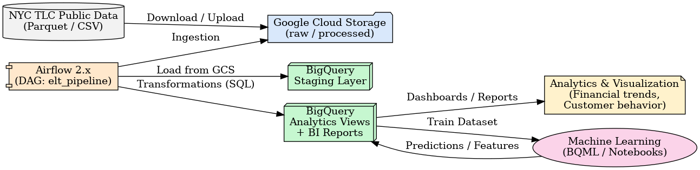

**Flow (high level):**
1. **Data Source**: Public NYC TLC Yellow Taxi trip records (Parquet/CSV).
2. **Ingestion & Storage**: Files are downloaded and uploaded into **Google Cloud Storage (GCS)** (raw and processed zones).
3. **Orchestration**: **Apache Airflow** DAG (`elt_pipeline`) automates ingestion, loading, and transformations.
4. **Data Warehouse**: **BigQuery** hosts staging tables and analytics views.
5. **Analytics**: SQL queries generate financial metrics, market demand analysis, and customer behavior insights (BI-style dashboards and reports).
6. **Machine Learning**: A derived dataset is used for ML experiments (BQML or Jupyter Notebooks), producing predictions and enriched features.

## Tech Stack & Skills Demonstrated

### ☁️ Cloud & Data Engineering
- **Google Cloud Platform (GCP)**: BigQuery, Cloud Storage (GCS), IAM
- **Apache Airflow 2.x**: DAG orchestration, scheduling, task dependencies
- **SQL (BigQuery StandardSQL)**: data modeling, transformations, analytics views
- **Python 3.10+**: ingestion scripts, data preparation, orchestration tasks

### 📊 Analytics
- Built SQL queries to analyze **financial performance**, **pricing strategies**, and **market demand trends**
- Designed transformations for **customer behavior insights** and **competitive analysis**
- Delivered exploratory notebooks with visualizations and reporting

### 🤖 Machine Learning
- Prepared feature datasets from transformed BigQuery tables
- Conducted experiments with **BQML** and **Python notebooks**
- Trained predictive models on taxi trip demand and revenue patterns

### 🔒 Best Practices
- Secrets and configuration handled via **environment variables** / Airflow Variables
- Modular pipeline design with clear separation: ingestion, staging, transforms, analytics, ML
- Documentation, reproducibility, and use of **public datasets** for transparency

## Implementation Workflow

This project was implemented end-to-end on **Google Cloud Platform**.  
Even though the full pipeline is no longer deployed, the following steps describe the exact workflow I built:

1. **Data Ingestion**
   - Downloaded monthly NYC Yellow Taxi trip data (Parquet format) from the [NYC TLC open dataset](https://www.nyc.gov/site/tlc/about/tlc-trip-record-data.page).
   - Uploaded raw data into Google Cloud Storage (GCS) buckets (`raw/` and `processed/` zones).

2. **Orchestration**
   - Built an Apache **Airflow DAG (`elt_pipeline`)** to automate:
     - Data ingestion from source → GCS
     - Loading raw files into BigQuery staging tables
     - Running SQL transformations into analytics views
     - Creating ML-ready datasets

3. **Data Warehouse (BigQuery)**
   - Designed staging → transformed → analytics layers
   - Wrote SQL queries for financial KPIs, demand trends, and customer behavior analysis

4. **Analytics**
   - Generated multiple **visual reports**: revenue trends, pricing analysis, and market demand insights
   - Produced exploratory notebooks with data visualizations

5. **Machine Learning**
   - Prepared feature datasets directly in BigQuery
   - Trained predictive models using BQML and Jupyter notebooks
   - Delivered predictions and enriched datasets for further analytics

---

> 📌 Note: The pipeline is currently not deployed to avoid cloud costs.  
> However, the repository contains **all the DAGs, SQL scripts, and notebooks** required to understand and adapt the project.


## Pipeline Steps

The core of the project is an **Apache Airflow DAG** called `elt_pipeline`.  
It orchestrates the entire workflow from raw data ingestion to analytics and machine learning datasets.

### 🔄 DAG Workflow

1. **Download Data**  
   - Fetch monthly Yellow Taxi trip data (Parquet/CSV) from NYC TLC.  
   - Store raw files locally before uploading to the cloud.

2. **Upload to GCS**  
   - Push raw trip files into Google Cloud Storage (`raw/` bucket).  
   - Data is organized by year/month for partitioning.

3. **Load into BigQuery (Staging)**  
   - Create external or managed tables from GCS.  
   - Apply initial schema definition and type casting.

4. **Transformations (Analytics Layer)**  
   - Run SQL queries to clean, aggregate, and enrich the staging data.  
   - Build **analytics views** for financial KPIs, pricing insights, demand analysis, and customer behavior.

5. **Analytics & Reporting**  
   - Use SQL and notebooks to generate charts and reports (e.g. revenue trends, average trip costs, demand by location).

6. **Machine Learning Preparation**  
   - Prepare features (trip duration, distance, location, time-based variables).  
   - Create an ML-ready dataset in BigQuery.

7. **Model Training & Predictions**  
   - Train predictive models (e.g. demand forecasting, revenue trends) using **BQML** or Python notebooks.  
   - Store predictions back into BigQuery for further analysis.

---

## Results & Visuals

## 1. Airflow DAG Monitoring

The pipeline is orchestrated with Apache Airflow (GCP Composer).  
Here are monitoring screenshots for observability and reliability:

- **DAG Graph**: overall orchestration of tasks  
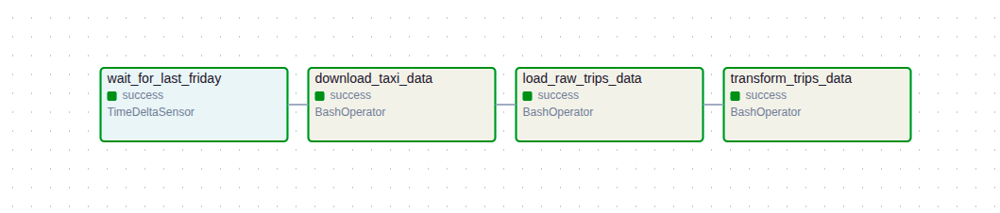

- **Run History & Logs**: detailed execution trace  
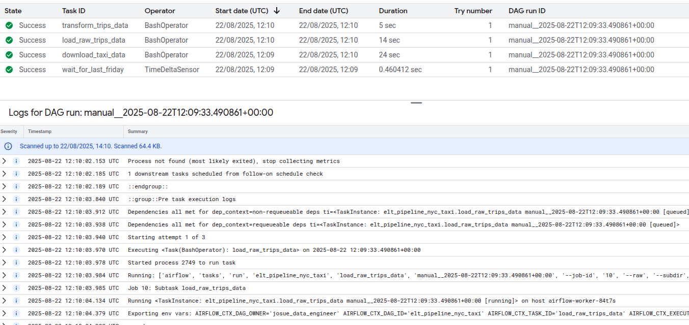  

- **Gantt Chart**: parallelism and task scheduling over time  
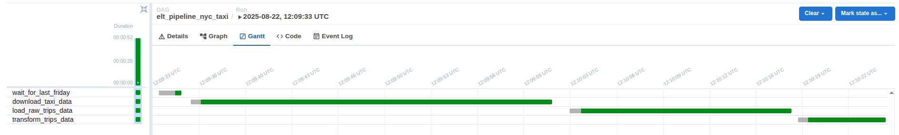

- **Task Duration**: execution performance comparison  
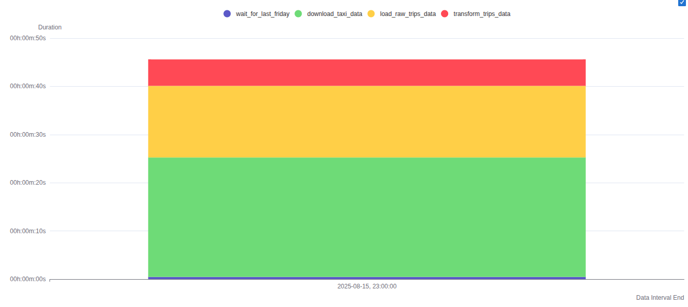

- **Success Heatmap**: reliability across scheduled runs  
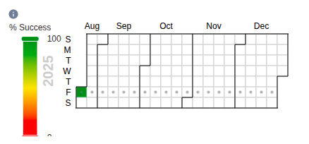

- **DAG Code Snippet** (schedule + tasks):  
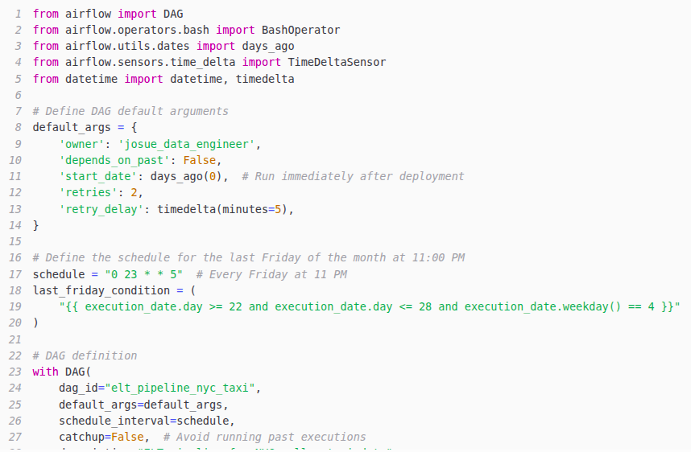

---

### 2. BigQuery Query Example
One of the analytical views created in BigQuery is `peak_hours_by_zone`, which highlights the busiest pickup times by location.

```sql
SELECT * FROM `yello-taxi-trips-analystics.views_fordashboard.peak_hours_by_zone` LIMIT 10;
```

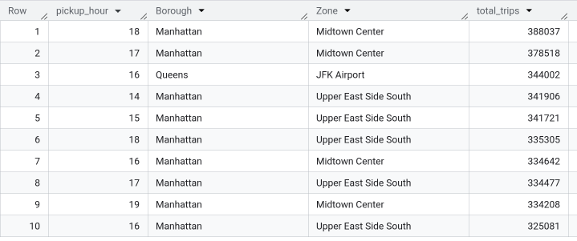

#### Passenger Trends by Season
This view analyzes how passenger demand changes across different seasons, helping identify peak and low periods.

```sql
SELECT *vFROM `yello-taxi-trips-analystics.views_fordashboard.passenger_trends_by_season` LIMIT 10;
```


#### Average Fare Analysis
This view focuses on financial performance by calculating the average fare, which is useful for pricing strategy and revenue insights.

```sql
SELECT * FROM `yello-taxi-trips-analystics.views_fordashboard.average_fare_analysis` LIMIT 10;
```

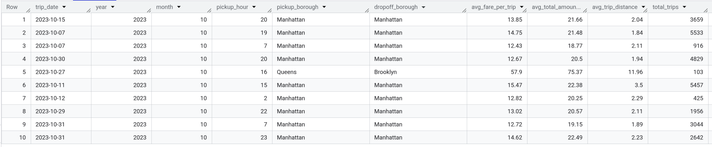

### 3. Analytics Visualizations

The transformed BigQuery views were used to create multiple **analytics dashboards**.  
These provide both **financial/business insights** and **operational/competitive insights**.

#### 📊 Financial Reports
- **Taxi Revenue Trends Over Time**  
  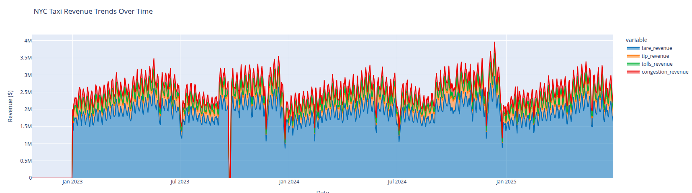

- **Mouthly Revenue Breakdown**  
  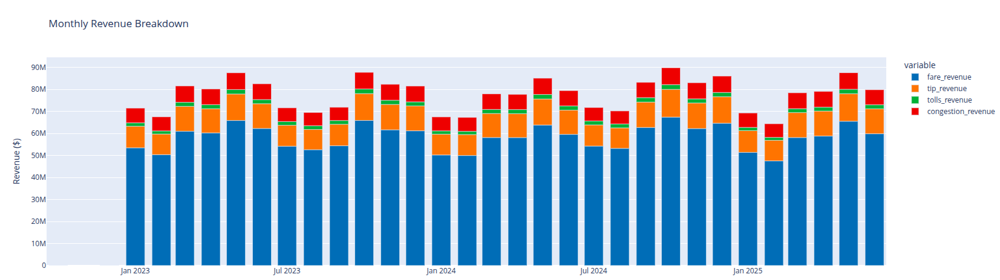

- **Proportion of Payment Methods**  
  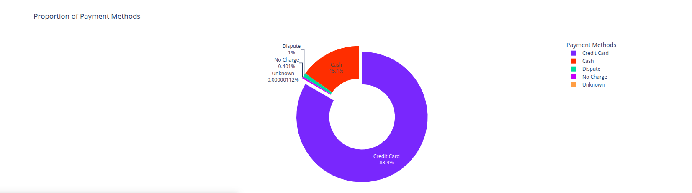

- **Tipping Trends by Time of Day & Borough**  
  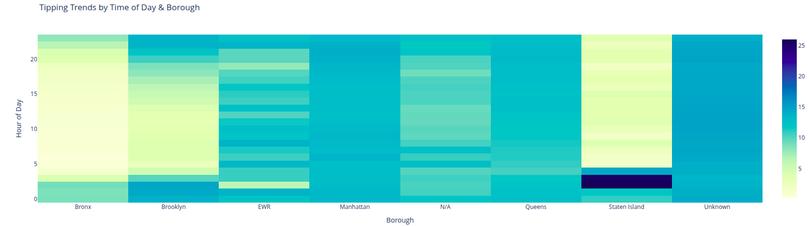

---

#### 🏙️ Competitive & Operational Insights
- **Total Trip Volume by Borough**  
  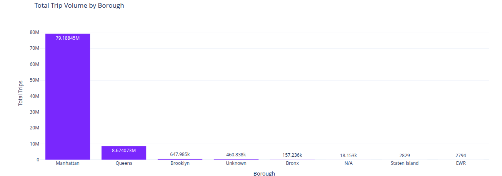

- **Trip Volume Over Time by Borough**  
  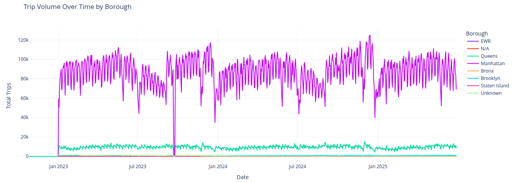

- **Total Trips by Airport**  
  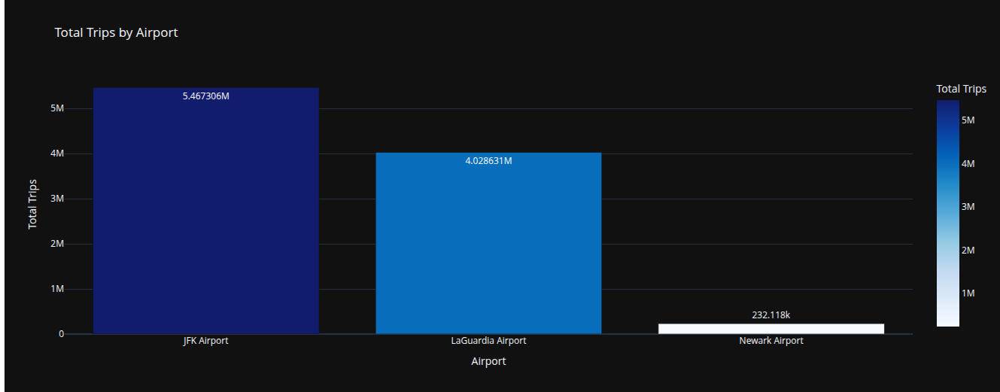

### 🤖 Machine Learning Insights
### 4) Machine Learning — Boosted Tree Regressor (BQML)

**Goal:** predict `predicted_total_amount` from trip features (time, distance, locations, payment, etc.).

#### Feature Schema (label & features)
The ML dataset is engineered directly in BigQuery; below is the label and the main features used:

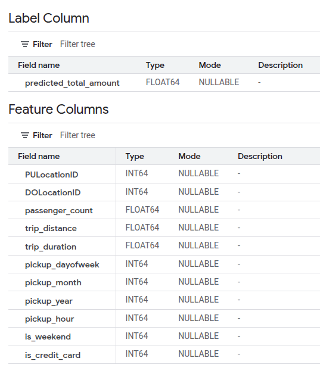

#### Training & Convergence
Model trained with BigQuery ML (Boosted Tree Regressor).  
Loss decreases over iterations; training durations and learning rate shown below:

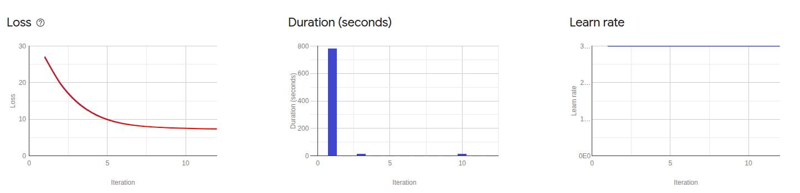

#### Evaluation Metrics
The model achieves strong performance on the holdout set:

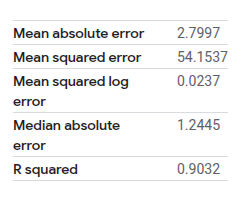

> Example metrics: MAE, MSE, MSLE, Median AE, and R².

#### Useful BQML Queries

**Evaluate the model**
```sql
SELECT *
FROM ML.EVALUATE(
  MODEL `yello-taxi-trips-analystics.ml_dataset.boosted_tree_regressor_model`
);
```

#### Feature importance (tree-based models)

```sql
SELECT *
FROM ML.FEATURE_IMPORTANCE(
  MODEL `yello-taxi-trips-analystics.ml_dataset.boosted_tree_regressor_model`
)
ORDER BY importance DESC;
```

SELECT *
FROM ML.PREDICT(
  MODEL `yello-taxi-trips-analystics.ml_dataset.boosted_tree_regressor_model`,
  (
    SELECT
      PULocationID, DOLocationID, passenger_count, trip_distance, trip_duration,
      pickup_dayofweek, pickup_month, pickup_year, pickup_hour,
      is_weekend, is_credit_card
    FROM `yello-taxi-trips-analystics.ml_dataset.<your_table>`
    -- WHERE clause for a specific time window, if needed
  )
);

#### Generate predictions

```sql
SELECT *
FROM ML.PREDICT(
  MODEL `yello-taxi-trips-analystics.ml_dataset.boosted_tree_regressor_model`,
  (
    SELECT
      PULocationID, DOLocationID, passenger_count, trip_distance, trip_duration,
      pickup_dayofweek, pickup_month, pickup_year, pickup_hour,
      is_weekend, is_credit_card
    FROM `yello-taxi-trips-analystics.ml_dataset.preprocessed_train_data`
  )
);
```


## Repository Structure

```
nyc-yellow-taxi-trips/
├── dags/
│ └── elt_dag_pipeline.py # Main Airflow DAG
├── data/
│ └── taxi_zone_lookup.csv # Lookup table for taxi zones
├── docs/
│ ├── airflow_dag.png # Airflow DAG graph
│ ├── architecture.png # Project architecture diagram
│ ├── avg_fare_analysis.png # Analytics: average fare results
│ ├── monthly_revenue_breakdown.png# Analytics: revenue trends
│ ├── passenger_trends_by_season.png
│ ├── proportion_payment_methods.png
│ ├── query_result_peak_hours_by_zone.png
│ ├── taxi_revenue_trends_overt_time.png
│ ├── tipping_trends_by_time.png
│ ├── total_trips_airport.png
│ ├── total_trip_volume_borough.png
│ └── trip_volume_over_time_borough.png
├── env/ # Local Python virtual environment (not versioned)
├── LICENSE
├── notebooks/
│ ├── Custom Model.ipynb # ML experiments
│ ├── Report 2.ipynb
│ ├── Report 3.ipynb
│ ├── Report 4.ipynb
│ └── Report Notebook.ipynb # Analytics visualizations & reporting
├── queries/
│ ├── CompetitiveInsights.sql # SQL queries for competitive analysis
│ ├── Financial_and_Pricing.sql # SQL queries for financial KPIs
│ ├── MarketDemand_and_CustomerBehavior.sql
│ └── modeling_queries.sql # SQL queries for ML dataset preparation
├── README.md # Project documentation (this file)
├── requirements.txt # Python dependencies
├── scripts/
│ ├── create_datasets.py # Create BigQuery datasets
│ ├── create_ml_dataset_table.py # Prepare ML datasets
│ ├── download_taxi_data.py # Download raw TLC trip data
│ ├── exploratory_data_analysis.py # Exploratory data analysis script
│ ├── load_raw_trips_data.py # Load raw data into BigQuery
│ ├── load_test.py # Test loading scripts
│ └── transform_trips_data.py # Transform raw → analytics layer
└── yellow_taxi.db # SQLite database (local testing)
```

## Security & Cost Considerations

### 🔐 Security (no secrets in repo)
- **No secrets committed**: keep API keys / service accounts out of Git.  
  - Use environment variables (`.env` locally) and **Airflow Variables/Connections** in production.
  - Provide only `env.template/` (or `.env.example`) as a placeholder.
- **Service Accounts & IAM (least privilege)**:
  - One SA per component (ingestion, BQ load, analytics/ML) with minimal roles:
    - `roles/storage.objectViewer` or `objectAdmin` (only where needed)
    - `roles/bigquery.dataEditor` (staging) / `dataViewer` (analytics)
    - `roles/bigquery.jobUser` (to run queries/jobs)
  - Avoid `Editor` on the whole project.
- **Airflow connections**: store credentials in Airflow **Connections/Variables**, not in DAG code.
- **PII/Data governance**: NYC TLC data is public & anonymized; still treat any joins/lookups with care.
- **Local artifacts**: do not version local venvs or DBs.
  - `.gitignore` should include:  
    ```
    env/
    .venv/
    *.db
    .env
    ```

### 💸 Cost Control (GCP)
- **BigQuery**
  - Use **partitioned** (by date) and **clustered** tables to reduce scan costs.
  - Prefer **external tables** on Parquet in GCS when exploring data.
  - In queries, always **select only needed columns** and **filter by partitions**.  
  - Example (partition + cluster):
    ```sql
    CREATE TABLE dataset.trips_partitioned
    PARTITION BY DATE(pickup_datetime)
    CLUSTER BY PULocationID
    AS
    SELECT * FROM dataset.trips_raw;
    ```
  - Set **bi query limits** and **preview mode** for quick checks.
- **Cloud Storage**
  - Store raw files compressed (Parquet/ gzip) to lower storage costs.
  - Configure **Lifecycle rules** (e.g., delete or move to Nearline after N days).
- **Airflow / Composer**
  - If using Cloud Composer, **pause** or **delete** the environment when idle (Composer has a baseline cost).
  - For local demos, use **Docker Compose** instead of a managed environment.
- **Budgets & Alerts**
  - Set a **GCP Budget** + email alerts at 50/90/100% thresholds to avoid surprises.

> ℹ️ Note: The pipeline is currently turned off to avoid cloud costs. The repository remains fully documented to show design decisions, pipeline logic, and analytics/ML outputs.
